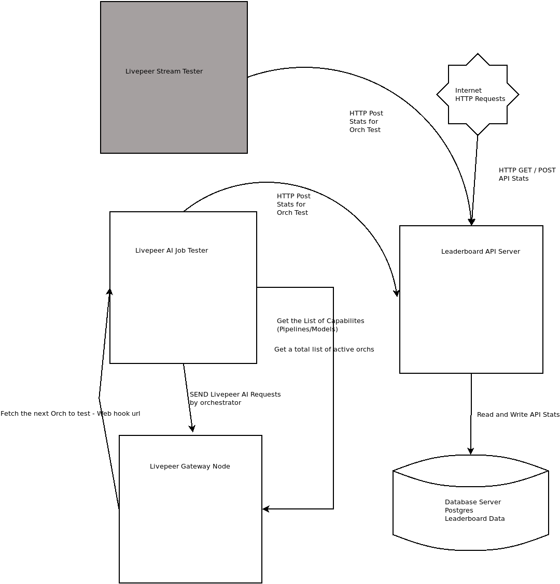
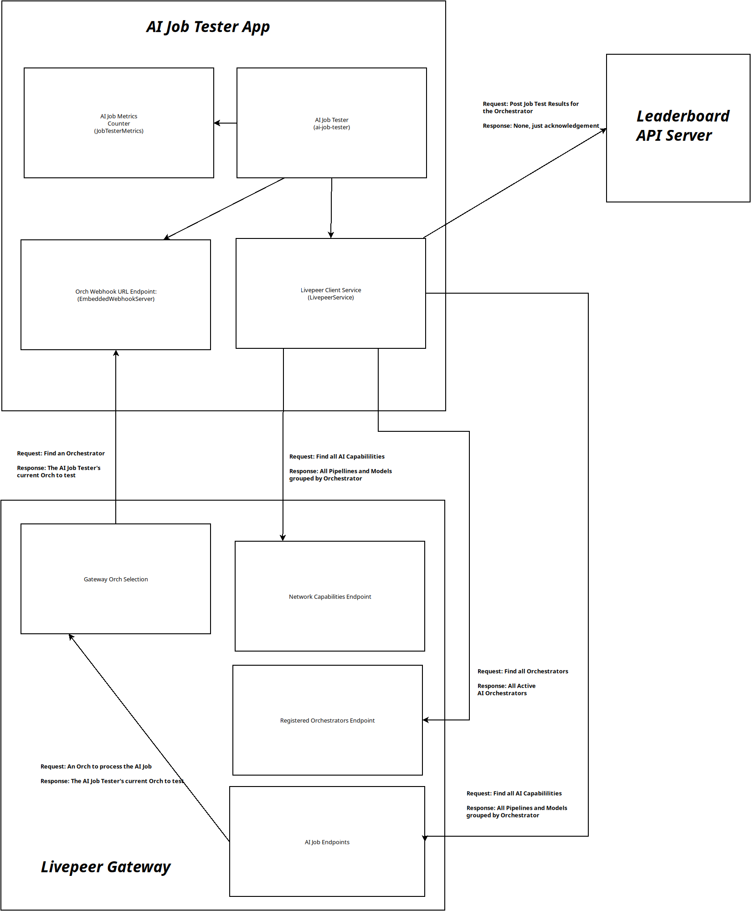

# The Livepeer AI Job Tester

## Overview
This application is responsible for executing AI Test Jobs against each Livepeer Orchestrator on the Livpeeer AI Network.

### Key Features Supported
* Each Orchestrator is only tested for the Pipelines and Models they support
* Configuration-based support for multiple pipelines and models.
  * Easily add new Pipeline and Model support over time.
* Integrates with the Livepeer Leaderboard Serverless API (TODO add link)
* Decoupled from go-livepeer Gateway Node.
  * Uses the HTTP Rest Endpoint to send jobs to the gateway node.
* Docker Supported
  * Enables `Crontab` scheduling of Test Jobs

### Figure 1 - AI Job Testing Architecture
This repository covers the *"Livepeer AI Job Tester"* box in the AI Job Testing architecture.



### Figure 2 - Application Architecture
The key components of the AI Job Tester application



#### AI Job Tester App
The main entrypoint for the application. This component is responsible for controlling the flow of the entire application
(find/test orchestrators, fetch pipeline/models, tracking job metrics, record job stats).

* **Embedded Webhook Server** - The HTTP endpoint that allows the Livepeer Gateway to determine which Orchestrator should be selected. The Livepeer Gateway refers to this as the "Orch Webhook URL".
* **Livepeer Client Service** - This component handles all HTTP Client interactions:
  1. _Livepeer Gateway_ -  Registered Orchestrators, Network Capabilities - Pipelines/Models, and AI Job processing
  2. _Leaderboard API Server_ - Post AI Job stats to the Leaderboard API Server (see Figure 1)

#### Livepeer Gateway

The Livepeer Gateway must be configured to test a single orchestrator.
To enable this behavior, the Gateway uses _Orch Webhoook URL_, _AI Session Timeout_ and _Orch Webhook Refresh Interval_.

The Livepeer Gateway was forked specifically to enable the configuration of these testing features.

**_Important:_** These changes are NOT currently in the main [go-livepeer repository](https://github.com/livepeer/go-livepeer).
To be considered for merging, the code would need further design review that is NOT planned as part of the _Livepeer.Cloud SPE proposal #2_.

The following git commits are required to run the Livepeer Gateway in "Job Tester Mode".  You can build and run the [Forked Branch](releases/livepeer.cloud/0.0.10-job-tester)

Here are the individual commits:
- Enable the Network Capabilities Endpoint
  - [commit](https://github.com/mikezupper/go-livepeer/commit/be3ded29f8fd24eff4f3b7526cd6f941326d177d)
- Allow the Gateway to override default timeout/cache intervals & ensure AISessionSelector is not caching
  - [commit](https://github.com/mikezupper/go-livepeer/commit/91b48749b0524fe2527dfadaec2ed53288c4f32e)

#### Leaderboard API Server
For more details see the [docs](https://github.com/mikezupper/livepeer-leaderboard-serverless/tree/tasks/livepeer.cloud/proposal2/add-ai-job-support)

## Build the Application

### Prerequisites

- Go Lang
- A Running Livepeer Gateway (configured for AI Test Jobs)

### Clone the Repo

Clone the Git Repo

`git clone https://github.com/mikezupper/livepeer-ai-job-tester.git`

Change to the Repo Directory

`cd livepeer-ai-job-tester`

### Build the Code

The following are environment variables that are needed to build:

`export CGO_ENABLED=0`

`export GOOS=linux`

`export GOARCH=amd64`

Build the binary

`go build -o ai-job-tester ./cmd/ai-job-tester.go`

### Configuration the Application
The application has several one command line argument `-f <full path to config file>`

The example file is located `configs/config.json`

#### config.json

This file configure the AI Job Tester application.

| Config Entry               | Description                                                                                                                                                                                        |
|----------------------------|----------------------------------------------------------------------------------------------------------------------------------------------------------------------------------------------------|
| `region`                   | The region code. _(default: NYC)_ (see [Region API Reference](https://github.com/mikezupper/livepeer-leaderboard-serverless/tree/tasks/livepeer.cloud/proposal2/add-ai-job-support#api-reference)) |
| `jobType`                  | The job type _(default: ai)_. Currently supports `ai`. New Types maybe be added in the future.                                                                                                     |
| `internalWebServerPort`    | The EmbeddedWebServer (Orch Webhook URL) will listen on this port _(default: 7934)_.                                                                                                               |
| `internalWebServerAddress` | The EmbeddedWebServer (Orch Webhook URL) will listen on this network ip address _(default: 0.0.0.0)_.                                                                                              |
| `metricsApiEndpoint`       | The URL to the Leaderboard API [post_stats endpoint](https://github.com/mikezupper/livepeer-leaderboard-serverless/tree/tasks/livepeer.cloud/proposal2/add-ai-job-support#api-reference)           |
| `metricsSecret`            | The `SECRET` key used by the Leaderboard API Server.                                                                                                                                               |
| `broadcasterJobEndpoint`   | The URL to the Livepeer Gateway AI Job Endpoint.                                                                                                                                                   |
| `broadcasterCliEndpoint`   | The URL to the Livepeer Gateway CLI Endpoint.                                                                                                                                                      |
| `broadcasterRequestToken`  | Optional: A Unique Token to send with each AI Job.                                                                                                                                                 |
| `pipelines`                | The configuration of each model and pipeline. This includes the API input parameters used for AI Job submission. |

_**Note:**_ pipelines that require input assets (images or audio) the test files are located in the `tests-assets/` folder. When adding new pipelines, make sure to update the ai job submission logic in `internal/server/server.go` `SendTestJob` function.
##### Example Configuration
```json
{
  "region": "NYC",
  "jobType" : "ai",
  "internalWebServerPort": "7934",
  "internalWebServerAddress": "0.0.0.0",
  "metricsApiEndpoint": "https://localhost:8080/api/post_stats",
  "metricsSecret": "my-secret-key",
  "broadcasterJobEndpoint": "http://localhost:8935",
  "broadcasterCliEndpoint": "http://localhost:7935",
  "broadcasterRequestToken": "None",
  "pipelines": [
    {
      "name": "Segment anything 2",
      "uri": "segment-anything-2",
      "capture_response": false,
      "contentType": "multipart/form-data",
      "parameters": {
        "box": "[380.50, 130.00, 651.50, 479.00]",
        "multimask_output": true,
        "return_logits": true,
        "normalize_coords": true,
        "safety_check": false
      }
    },
    {
      "name": "Text to image",
      "uri": "text-to-image",
      "capture_response": true,
      "contentType": "application/json",
      "parameters": {
        "prompt": "a bear",
        "width": 512,
        "height": 512,
        "num_images_per_prompt": 1,
        "num_inference_steps": 20,
        "guidance_scale": 2,
        "safety_check": false
      }
    },
    {
      "name": "Image to image",
      "uri": "image-to-image",
      "capture_response": true,
      "contentType": "multipart/form-data",
      "parameters": {
        "guidance_scale": 2,
        "image_guidance_scale": 2,
        "num_images_per_prompt": 1,
        "num_inference_steps": 20,
        "prompt": "a bear",
        "safety_check": false,
        "strength": 1
      }
    },
    {
      "name": "Image to video",
      "uri": "image-to-video",
      "capture_response": true,
      "contentType": "multipart/form-data",
      "parameters": {
        "width": 1024,
        "height": 576,
        "fps": 8,
        "motion_bucket_id": 127,
        "noise_aug_strength": 0.065
      }
    },
    {
      "name": "Upscale",
      "uri": "upscale",
      "capture_response": true,
      "contentType": "multipart/form-data",
      "parameters": {
        "prompt": "a bear",
        "width": 512,
        "height": 512,
        "num_images_per_prompt": 1,
        "num_inference_steps": 20,
        "guidance_scale": 2,
        "safety_check": false
      }
    },
    {
      "name": "Audio to text",
      "uri": "audio-to-text",
      "capture_response": true,
      "contentType": "multipart/form-data",
      "parameters": {
      }
    },
    {
      "name": "Large language model",
      "uri": "llm",
      "capture_response": true,
      "contentType": "multipart/form-data",
      "parameters": {
        "max_tokens": 256,
        "prompt": "how many characters are in an ethereum address?"
      }
    }
  ]
}
```

## Docker
The use of docker is encouraged but not required.

### Build the Image

`docker build ai-job-tester:latest .`

## Run the Application

To run the AI Job Tester application, You will need `docker compose`.

The `docker-compose.yml` will allow you to run the applications needed: AI Job Tester and Livepeer Gateway
You must create the following docker volumes (and configure them appropriately:

_ai-job-tester_ - stores the `configs/config.json` file needed to run `ai-job-tester`. You must configure the file and place in the volume's directory.
`docker volume create ai-job-tester`

_tester-gateway-lpData_ - The Livepeer Gateway's `.lpData` folder. You must configure the required livepeer files and place in the volume's directory.

`docker volume create tester-gateway-lpData`

### Job Scheduling

The `ai-job-tester` docker image allows job scheduling using Linux `crontab`. `The docker-compose.yml` file has an environment variable to allow custom schedules.


Example runs every hour on the 0 minute: `- CRONTAB_SCHEDULE=0 */1 * * *`

### docker-compose.yml
```
services:
  ai-job-tester:
    image: ai-job-tester:latest
    container_name: "ai-job-tester"
    volumes:
      - ai-job-tester:/app/configs
    environment:
      - TZ=UTC
      - CRONTAB_SCHEDULE=0 */1 * * *
      - CONFIG_FILE=/app/configs/config.json
    depends_on:
      - tester-gateway

  tester-gateway:
    image: tztcloud/go-livepeer:v0.7.9-ai.3-v0.0.10-livepeer-cloud-job-tester
    restart: unless-stopped
    hostname: tester-gateway
    container_name: tester-gateway
    volumes:
      - tester-gateway-lpData:/root/.lpData
    command: '-ethUrl=YOUR_RPC_URL
              -ethPassword=/root/.lpData/eth-secret.txt
              -ethKeystorePath=/root/.lpData
              -network=arbitrum-one-mainnet
              -serviceAddr=ai-tester-gateway:8935
              -cliAddr=ai-tester-gateway:7935
              -gateway=true
              -monitor=true
              -maxPricePerUnit=125000000
              -maxTotalEV=100000000000000
              -v=5
              -pixelsPerUnit=1
              -blockPollingInterval=20
              -httpIngest=true
              -httpAddr=0.0.0.0:8935
              -orchMinLivepeerVersion=v0.7.9-ai.3
              -discoveryTimeout=750ms
              -webhookRefreshInterval=0
              -aiSessionTimeout=0
              -orchWebhookUrl=http://ai-job-tester:7934/orchestrators
              '

volumes:
  tester-gateway-lpData:
    external: true

  ai-job-tester:
    external: true
```

**_Note:_** Take note of the configuration flags that are needed to run a Livepeer Gateway in "Job Test Mode"

`-discoveryTimeout=750ms`
`-webhookRefreshInterval=0`
`-aiSessionTimeout=0`
`-orchWebhookUrl=http://ai-job-tester:7934/orchestrators`

## Performance Scores????
