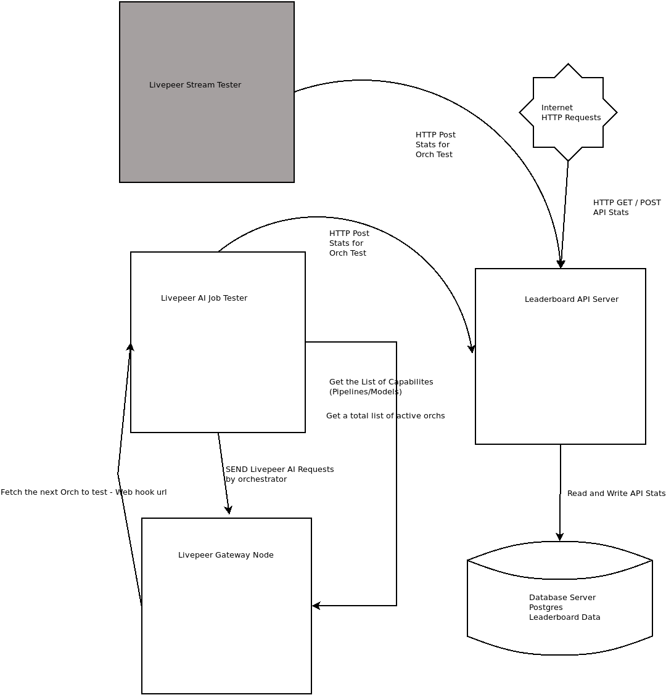
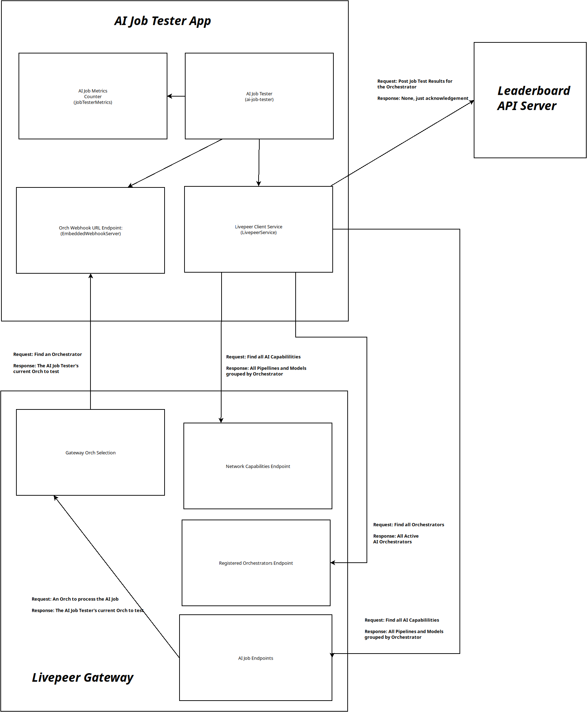

# The Livepeer AI Job Tester

## Overview
The **Livepeer AI Job Tester** is a versatile tool for executing AI test jobs across all Livepeer Orchestrators on the Livepeer AI Network. Its purpose is to ensure each Orchestrator is tested only on the pipelines and models they support, allowing seamless testing and the production of network reliability metrics.

## Key Features

- **Targeted Testing**  
  Each Orchestrator is only tested for the pipelines and models it supports, ensuring efficient and accurate testing.

- **Configuration-Based Flexibility**  
  Easily manage support for multiple pipelines and models through a configuration-based system. New pipelines and models can be added over time without modifying the core code.

- **Integration with Livepeer Leaderboard**  
  Integrates with the [Livepeer Leaderboard Serverless API](https://github.com/livepeer/leaderboard-serverless)) for enhanced reporting and Orchestrator performance tracking.

- **Decoupled Architecture**  
  Operates independently of the `go-livepeer` Gateway Node, using HTTP REST endpoints to send AI jobs directly to a separately deployed Gateway node.

- **Docker Support**  
  Fully Dockerized for easy setup and deployment across various environments.

- **Scheduled Job Execution**  
  Supports `Crontab` scheduling to automate the execution of test jobs at regular intervals.

### Figure 1 - AI Job Testing Architecture
This repository covers the *"Livepeer AI Job Tester"* box in the AI Job Testing architecture.



### Figure 2 - Application Architecture
The key components of the AI Job Tester application



#### AI Job Tester App
The main entrypoint for the application. This component is responsible for controlling the flow of the entire application
(find/test orchestrators, fetch pipeline/models, tracking job metrics, record job stats).

* **Embedded Webhook Server** - The HTTP endpoint that allows the Livepeer Gateway to determine which Orchestrator should be selected. The Livepeer Gateway refers to this as the "Orch Webhook URL".
* **Livepeer Client Service** - This component handles all HTTP Client interactions:
  1. _Livepeer Gateway_ -  Registered Orchestrators, Network Capabilities - Pipelines/Models, and AI Job processing
  2. _Leaderboard API Server_ - Post AI Job stats to the Leaderboard API Server (see Figure 1)

#### Livepeer Gateway
As the AI Job Tester iterates through the list of Orchestrators, it notifies the Livepeer Gateway about which Orchestrator to run the test scenarios against.
To enable this behavior, the Gateway uses `orchWebhookUrl`, `aiSessionTimeout`, `aiTesterGateway` and `webhookRefreshInterval`.

**_Important:_** The following pull request must be merged to run the AI Job Tester gateway

[#3236 - Enable Single Orchestrator AI Job Testing Support for Gateway Nodes](https://github.com/livepeer/go-livepeer/pull/3236)

#### Leaderboard API Server
For more details see the [docs](https://github.com/mikezupper/livepeer-leaderboard-serverless/tree/tasks/livepeer.cloud/proposal2/add-ai-job-support)

## Build the Application

### Prerequisites

- Go Lang
- A Running Livepeer Gateway (configured for AI Test Jobs)

### Clone the Repo

Clone the Git Repo

`git clone https://github.com/mikezupper/livepeer-ai-job-tester.git`

Change to the Repo Directory

`cd livepeer-ai-job-tester`

### Build the Code

The following are environment variables that are needed to build:

`export CGO_ENABLED=0`

`export GOOS=linux`

`export GOARCH=amd64`

Build the binary

`go build -o ai-job-tester ./cmd/ai-job-tester.go`

### Configuration the Application
The application has several one command line argument `-f <full path to config file>`

The example file is located `configs/config.json`

#### config.json

This file configures the AI Job Tester application.

| Config Entry               | Description                                                                                                                                                                                        |
|----------------------------|----------------------------------------------------------------------------------------------------------------------------------------------------------------------------------------------------|
| `region`                   | The region code. _(default: NYC)_ (see [Region API Reference](https://github.com/mikezupper/livepeer-leaderboard-serverless/tree/tasks/livepeer.cloud/proposal2/add-ai-job-support#api-reference)) |
| `jobType`                  | The job type _(default: ai)_. Currently supports `ai`. New Types maybe be added in the future.                                                                                                     |
| `internalWebServerPort`    | The EmbeddedWebServer (Orch Webhook URL) will listen on this port _(default: 7934)_.                                                                                                               |
| `internalWebServerAddress` | The EmbeddedWebServer (Orch Webhook URL) will listen on this network ip address _(default: 0.0.0.0)_.                                                                                              |
| `metricsApiEndpoint`       | The URL to the Leaderboard API [post_stats endpoint](https://github.com/mikezupper/livepeer-leaderboard-serverless/tree/tasks/livepeer.cloud/proposal2/add-ai-job-support#api-reference)           |
| `metricsSecret`            | The `SECRET` key used by the Leaderboard API Server.                                                                                                                                               |
| `broadcasterJobEndpoint`   | The URL to the Livepeer Gateway AI Job Endpoint.                                                                                                                                                   |
| `broadcasterCliEndpoint`   | The URL to the Livepeer Gateway CLI Endpoint.                                                                                                                                                      |
| `broadcasterRequestToken`  | Optional: A Unique Token to send with each AI Job.                                                                                                                                                 |
| `pipelines`                | The configuration of each model and pipeline. This includes the API input parameters used for AI Job submission. |
| `liveVideo.ingestURL`      | Base RTMP ingest URL used when pushing the test stream (the tester appends `aiJobTesterStream`). |
| `liveVideo.playbackURL`    | Base RTMP playback URL used by `ffprobe` to measure output (the tester appends `aiJobTesterStream-out`). |
| `liveVideo.testVideoPath`  | The path to the video asset to be used for live video tests.
| `liveVideo.testDurationSeconds` | Duration, in seconds, to collect live metrics for each test. |
| `liveVideo.probeGracePeriodSeconds` | Delay before `ffprobe` starts, allowing the Gateway to warm the live pipeline. |
| `liveVideo.orchMapping`    | Map of orchestrator addresses to their live URIs, overriding on-chain service URIs for live video runs. |

_**Note:**_ pipelines that require input assets (images or audio) the test files are located in the `tests-assets/` folder. When adding new pipelines, make sure to update the ai job submission logic in `internal/server/server.go` `SendTestJob` function.

### Live Video Pipeline Configuration

Each live-enabled pipeline must also mark the configuration with `"live": true` and provide any runtime parameters required by the Gateway.

### Orchestrator Discovery for Live Jobs

The Gateway cannot rely on the on-chain Service Registry to discover live AI capabilities and all Orchestrator URIs. Populate `configs/live-video-orchestrators.json` with the exact orchestrator addresses that should receive live video tests. The Gateway reads this file and uses the entries to validate capabilities before the tester runs a job.  This is used in combination with `liveVideo.orchMapping` to find the Orchestrator and override the published service URI with a list of appropraite URIs to test.

### Mediamtx Integration

`configs/mediamtx/mediamtx.yml` defines two relevant RTMP paths:

- `aiJobTesterStream` – Uses `runOnReady` to invoke the Gateway CLI and start a live video session as soon as the tester pushes the input RTMP stream.
- `aiJobTesterStream-out` – Records the transformed output when recording is enabled, allowing you to inspect the final video produced by the orchestrator.

Ensure the Mediamtx container shares the same network namespace as the Gateway so these hooks can execute successfully.  Also, you must map a volume for the recordings if you want them to persists outside the container.

### testMode

Set `"testMode": true` in `configs/config.json` to bypass real Gateway and Leaderboard calls. In this mode the tester immediately runs against a small set of mock orchestrators and prints the statistics rather than publishing them.

### Live AI Video Data Flow

1. The tester determines whether a job is live by inspecting the pipeline configuration (`live: true`). Live jobs push the static fixture video to the Gateway via RTMP using the parameters defined in the pipeline block.
2. The static video file in `test-assets` is streamed to Mediamtx, which forwards it to the Gateway using the `aiJobTesterStream` key.
3. The tester launches `ffprobe` against the configured playback URL, sampling frames for the configured duration to measure FPS and end-to-end latency.
4. After the interval elapses the tester cancels the ffmpeg push, stopping the live video session.
5. The collected metrics are rolled up into the job tester stats payload (average FPS, latency, frame count) before being posted to the Leaderboard or logged in `testMode`.

##### Example Configuration
```json
{
  "region": "NYC",
  "jobType" : "ai",
  "internalWebServerPort": "7934",
  "internalWebServerAddress": "0.0.0.0",
  "metricsApiEndpoint": "https://localhost:8080/api/post_stats",
  "metricsSecret": "my-secret-key",
  "broadcasterJobEndpoint": "http://localhost:8935",
  "broadcasterCliEndpoint": "http://localhost:7935",
  "broadcasterRequestToken": "None",
  "pipelines": [
    {
      "name": "Segment anything 2",
      "uri": "segment-anything-2",
      "capture_response": false,
      "contentType": "multipart/form-data",
      "parameters": {
        "box": "[380.50, 130.00, 651.50, 479.00]",
        "multimask_output": true,
        "return_logits": true,
        "normalize_coords": true,
        "safety_check": false
      }
    },
    {
      "name": "Text to image",
      "uri": "text-to-image",
      "capture_response": true,
      "contentType": "application/json",
      "parameters": {
        "prompt": "a bear",
        "width": 512,
        "height": 512,
        "num_images_per_prompt": 1,
        "num_inference_steps": 20,
        "guidance_scale": 2,
        "safety_check": false
      }
    },
    {
      "name": "Image to image",
      "uri": "image-to-image",
      "capture_response": true,
      "contentType": "multipart/form-data",
      "parameters": {
        "guidance_scale": 2,
        "image_guidance_scale": 2,
        "num_images_per_prompt": 1,
        "num_inference_steps": 20,
        "prompt": "a bear",
        "safety_check": false,
        "strength": 1
      }
    },
    {
      "name": "Image to video",
      "uri": "image-to-video",
      "capture_response": true,
      "contentType": "multipart/form-data",
      "parameters": {
        "width": 1024,
        "height": 576,
        "fps": 8,
        "motion_bucket_id": 127,
        "noise_aug_strength": 0.065
      }
    },
    {
      "name": "Upscale",
      "uri": "upscale",
      "capture_response": true,
      "contentType": "multipart/form-data",
      "parameters": {
        "prompt": "a bear",
        "width": 512,
        "height": 512,
        "num_images_per_prompt": 1,
        "num_inference_steps": 20,
        "guidance_scale": 2,
        "safety_check": false
      }
    },
    {
      "name": "Audio to text",
      "uri": "audio-to-text",
      "capture_response": true,
      "contentType": "multipart/form-data",
      "parameters": {
      }
    },
    {
      "name": "Llm",
      "uri": "llm",
      "capture_response": true,
      "contentType": "multipart/form-data",
      "parameters": {
        "max_tokens": 256,
        "prompt": "how many characters are in an ethereum address?"
      }
    }
    {
      "name": "Live video to video",
      "uri": "live-video-to-video",
      "capture_response": false,
      "contentType": "application/json",
      "live": true,
      "parameters": {
        "pipeline": "streamdiffusion-sdxl"
      }
    }
  ]
}
```

## Docker
The use of docker is encouraged but not required.

### Build the Image

`docker build ai-job-tester:latest .`

## Run the Application

To run the AI Job Tester application, you will need `docker compose`.

The `docker-compose.yml` will allow you to run the applications needed: AI Job Tester and Livepeer Gateway.
You must create the following docker volumes (and configure them appropriately)

_ai-job-tester_ - stores the `configs/config.json` file needed to run `ai-job-tester`. You must configure the file and place in the volume's directory.

`docker volume create ai-job-tester`

_tester-gateway-lpData_ - The Livepeer Gateway's `.lpData` folder. You must configure the required livepeer files and place in the volume's directory.

`docker volume create tester-gateway-lpData`

### Job Scheduling

The `ai-job-tester` docker image allows job scheduling using Linux `crontab`. `The docker-compose.yml` file has an environment variable to allow custom schedules.


Example runs every hour on the 0 minute: 

`- CRONTAB_SCHEDULE=0 */1 * * *`

### docker-compose.yml
```
services:
  ai-job-tester:
    image: ai-job-tester:latest
    container_name: "ai-job-tester"
    volumes:
      - ai-job-tester:/app/configs
    environment:
      - TZ=UTC
      - CRONTAB_SCHEDULE=0 */1 * * *
      - CONFIG_FILE=/app/configs/config.json
    depends_on:
      - tester-gateway

  tester-gateway:
    image: tztcloud/go-livepeer:v0.7.9-ai.3-v0.0.11
    restart: unless-stopped
    hostname: tester-gateway
    container_name: tester-gateway
    volumes:
      - tester-gateway-lpData:/root/.lpData
    environment:
      - LIVEPEER_OS_HTTP_TIMEOUT=8s
    command: '-ethUrl=YOUR_RPC_URL
              -ethPassword=/root/.lpData/eth-secret.txt
              -ethKeystorePath=/root/.lpData
              -network=arbitrum-one-mainnet
              -serviceAddr=ai-tester-gateway:8935
              -cliAddr=ai-tester-gateway:7935
              -gateway=true
              -monitor=true
              -maxPricePerUnit=125000000
              -maxTotalEV=100000000000000
              -v=5
              -pixelsPerUnit=1
              -blockPollingInterval=20
              -httpIngest=true
              -httpAddr=0.0.0.0:8935
              -orchMinLivepeerVersion=v0.7.9-ai.3
              -aiTesterGateway=true
              -discoveryTimeout=100ms
              -webhookRefreshInterval=0
              -aiSessionTimeout=0
              -orchWebhookUrl=http://ai-job-tester:7934/orchestrators
              '

volumes:
  tester-gateway-lpData:
    external: true

  ai-job-tester:
    external: true
```

**_Note:_** Take note of the configuration flags that are needed to run a Livepeer Gateway in "Job Test Mode"
Environment Variables:
`LIVEPEER_OS_HTTP_TIMEOUT=8s`

Livepeer Startup Flags
`-aiTesterGateway=true`
`-discoveryTimeout=1000ms`
`-webhookRefreshInterval=0`
`-aiSessionTimeout=0`
`-orchWebhookUrl=http://ai-job-tester:7934/orchestrators`
