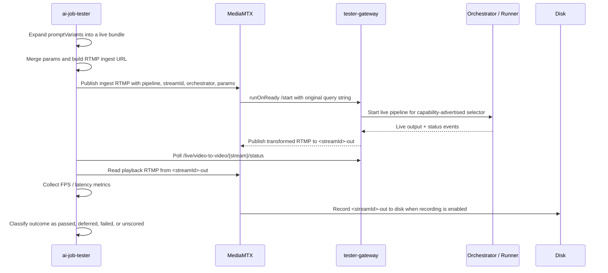
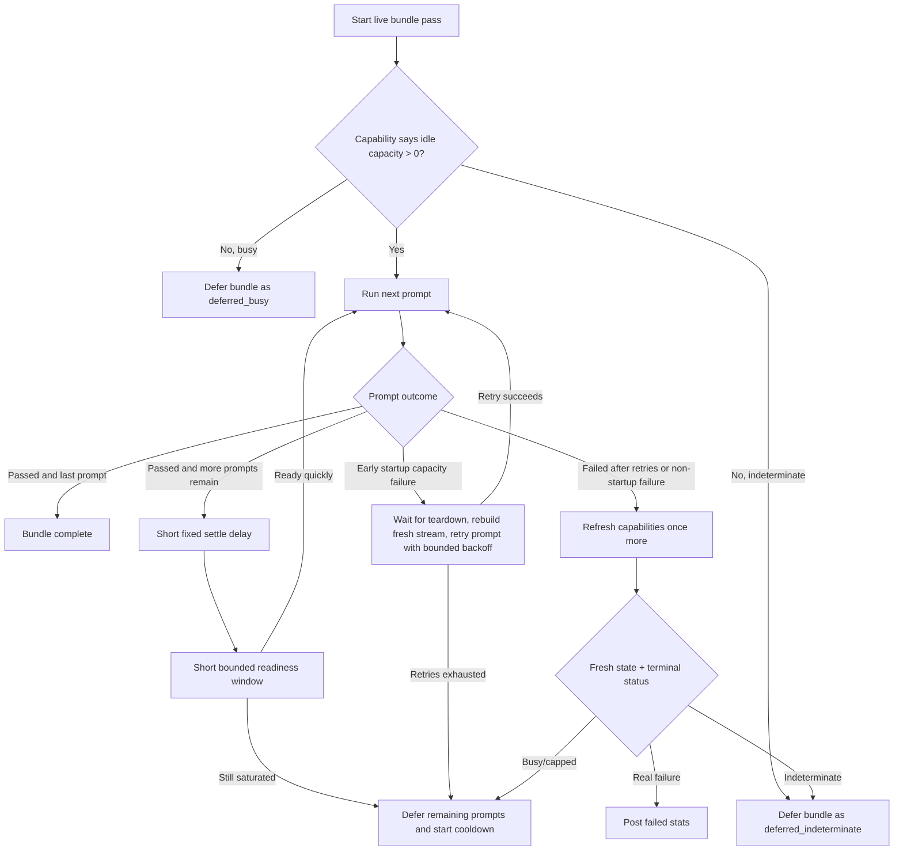
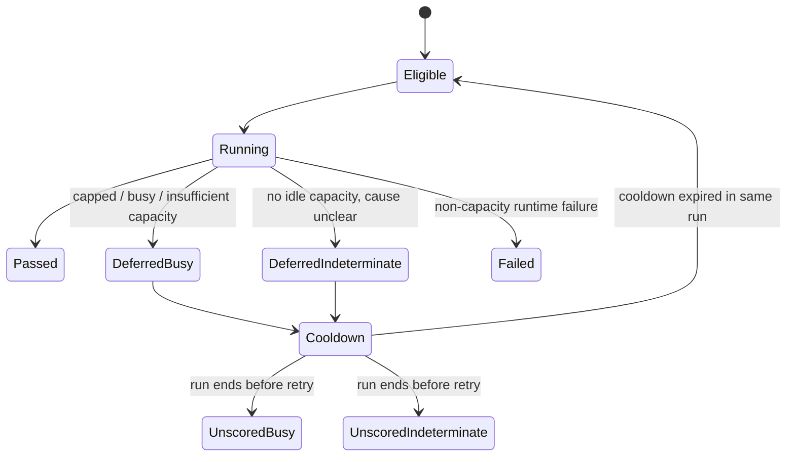
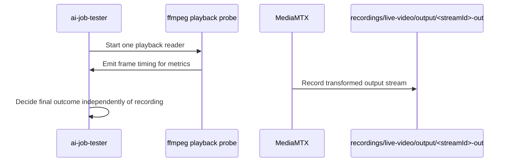

# Live Video Flow

This document describes the end-to-end `live-video-to-video` execution flow in the job tester, including:

- how the tester routes a live prompt to a specific orch
- how multi-prompt bundles are scheduled
- how busy/capped orchs are deferred and cooled down
- how MediaMTX recordings fit into the live flow

It is intended to complement the README by showing the system visually.

## Components

- `ai-job-tester`: expands config into live prompt scenarios, pushes ingest RTMP, collects metrics, and posts stats
- `MediaMTX`: receives the ingest RTMP stream and forwards the original query string to the Gateway
- `tester-gateway`: starts the live session, routes to the target orch, exposes live status, and emits output RTMP
- remote orchestrator / runner: executes the selected live pipeline

## High-Level Sequence



## Request Shape

The tester publishes to MediaMTX with a single RTMP URL shaped like:

```text
rtmp://<mediamtx-host>:1935/<streamId>?pipeline=<capability-model>&streamId=<streamId>&orchestrator=<service-uri>&params=<urlencoded-json>
```

Important distinctions:

- top-level `pipeline` is the capability-advertised live selector
- nested `params.model_id` is optional and only used when you explicitly want a runner-specific base-model override
- MediaMTX forwards the original query string unchanged to the Gateway start hook

## Multi-Prompt Bundle Scheduling

The tester groups prompt variants for the same orch/service URI/pipeline/capability-model into one live bundle. That matters because the second or third prompt in the same bundle often targets an orch that is still cleaning up from the previous prompt.

### Bundle Lifecycle



### Why There Is Both Readiness and Cooldown

The scheduler uses two different protections:

- settle delay:
  after one prompt succeeds, the tester waits a small fixed amount of time before trusting any readiness signal from the same orch/model
- bounded readiness window:
  after the settle delay, the tester gives that same orch/model a short chance to recover before sending the next prompt in the bundle
- cooldown:
  if that short window expires, the bundle is deferred and temporarily skipped for the rest of the current run so tiny bundle sets do not immediately hammer the same orch again

This is intentionally bounded:

- the tester does not poll forever waiting for an orch to recover
- startup retries apply only before readiness, and only for capacity-style startup rejections
- startup retries rebuild the live run with a fresh `stream_id` after a short teardown wait on the failed attempt, so retries are new gateway/MediaMTX sessions rather than reusing the old one
- if a bundle is still cooling down when the current run would otherwise just spin, the remaining prompts are finalized as `unscored`

## Busy / Capped Outcome Model

The tester treats these live-path signals as capacity problems rather than true test failures:

- capability response shows `idle_capacity == 0`
- terminal live status includes `OrchestratorCapped`
- terminal live status includes `OrchestratorBusy`
- terminal live status includes `insufficient capacity`
- terminal live status includes `no orchestrators available` and a fresh capability refresh still shows no idle capacity

Outcome behavior:



## MediaMTX Recording Flow

Live-output recording is owned by MediaMTX, not the tester:

- the tester always generates a unique `stream_id`
- MediaMTX publishes the transformed output on `<stream_id>-out`
- when recording is enabled for that plain playback path, MediaMTX writes the output stream under `recordings/live-video/output/<stream_id>-out/`
- the tester remains responsible only for metrics, prompt verification, and stats

### Recording Timing



## Operational Notes

- A passed prompt does not imply semantic prompt correctness; prompt verification only means the worker reported the expected params hash.
- A failed ingest with `broken pipe` on the tester side can still be a remote capacity problem if the Gateway already rejected the live request as capped/busy.
- For local debugging, `stream_id` plus the MediaMTX recording path is the easiest way to find the saved output on disk.

## Related Docs

- [README.md](/home/julian/Documents/development/spe-work/livepeer-ai-job-tester/README.md)
- [application_architecture.png](/home/julian/Documents/development/spe-work/livepeer-ai-job-tester/docs/application_architecture.png)
- [logical_architecture.png](/home/julian/Documents/development/spe-work/livepeer-ai-job-tester/docs/logical_architecture.png)
